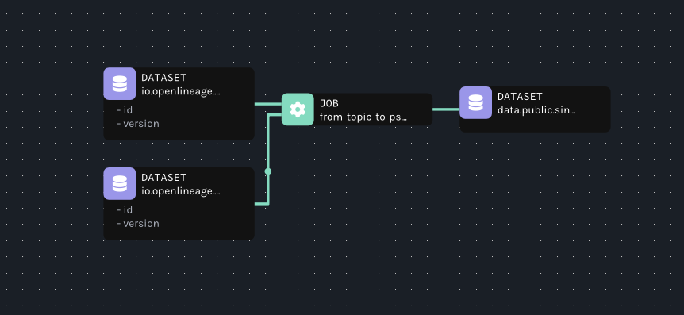
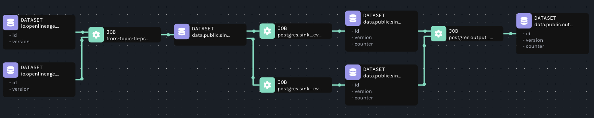
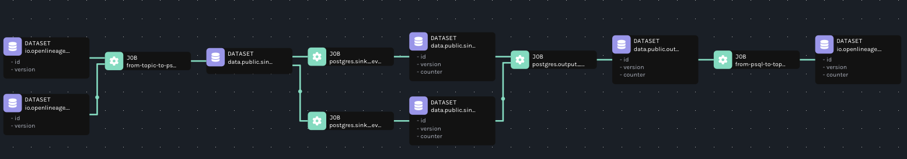

# OpenLineage Flink Streaming Demo

## Which `openlineage-flink` do you want to use?

An example Flink application uses `openlineage-flink.jar` which can be either downloaded from Maven
or build locally when testing local changes. This is controlled by `openLineageVersion` in
`flink-app/build.gradle`. Please be aware that using SNAPSHOT version requires local `build` and
`publishToMavenLocal`. Snapshot build requires also local build of `openlineag-java` and `openlineage-sql-java`.

## Build flink example app

Application is built with Java 11
```
sh ./flink app
./gradlew clean build
```

This shall result in `workshops/flink-streaming/flink-app/build/libs/flink-app.jar` being created.

Jar contains two applications:
* `io.openlineage.flink.FromTopicToPostgresApplication`
* `io.openlineage.flink.FromPostgresToTopicApplication`

Kafka data is serialized in Avro which definition is stored in Confluent Avro Schema Registry.

## Run environment

It is advised to delete all the containers before running environment up again each time.
```
docker-compose up
```

This should span:
* Kafka+Zookeeper+Schema Registry and generate some input topics' data as well as register Avro schema in Confluent Avro Schema Registry.
* Start Marquez being available under `http://localhost:3000`
* Start Airflow `http://localhost:8080` with (user: airflow and same value as password)
* Start postgres database
* Start first flink job which reads data from two Kafka topics and write to postgres database

Once up and running, after a moment first Flink job should emit OpenLineage event with an information
on Kafka topics it's reading data from and SQL table where it outputs a data. This can be verified
in Apache Flink Dashboard: `http://localhost:8081/#/overview`. Lineage graph representing the job
should be present in Marquez `http//localhost:3000`,
when namespace switched to `flink_job_namespace` on a job
`flink-topic-to-psql`:



Now we can go to Airflow to trigger a DAG handling Postgres SQL queries. In order to do this,
you can go to Airflow `http://localhost:8080/`, login with `airflow` / `airflow` user-password,
enable and run `postgres ` DAG. This should add extra nodes to lineage graph:



This presents the initial lineage graph combined with lineage of SQL queries run. Consistent naming
convention for Flink and SQL (cross-platform lineage) allows building lineaga graph that spans
multiple jobs.

Let us now trigger the second Flink job, that reads data from SQL and writes into output Kafka topic.
In fact, this application is already running, but it is waiting for `flink_trigger` DAG in Airflow
to be started. Enable and run the DAG in Airflow. The running job can be verified on another Flink Dashboard
`http://localhost:8082/#/overview` (this is different dashboard as jobs are run in standalone mode).

Now, go back to Marquez and increase graph depth setting to
`3`  (top-right corner). After reloading a page graph should contain a whole lineage with:
* Flink job reading from Kafka topic to Postgres
* Few SQL jobs running queries in Postgres
* Flink job taking Postgres table and publishing it back to Kafka.



Please note that lineage has been extracted automatically

#### Known issue with the demo
* It's recommended to delete all the containers when running demo again.
* A failing Flink job can break the lineage graph in Marquez [issue](https://github.com/MarquezProject/marquez/issues/2767).